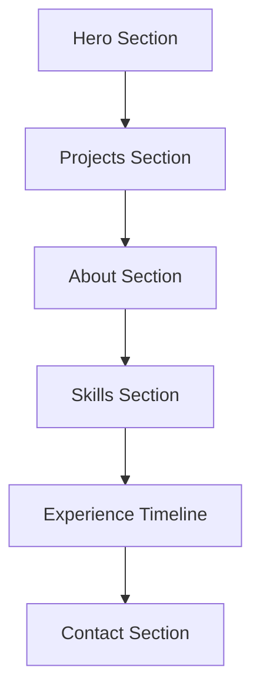

# Saugat Rai - Minimal Animated Portfolio

## Design Philosophy (Awwwards Inspired)

Based on award-winning portfolios like [torebentsen.com](https://www.torebentsen.com/) and [danial.si](https://danial.si/), the design will feature:

- **Clean typography** with large, bold headings
- **Ample whitespace** for minimal aesthetic
- **Purposeful animations** that enhance UX without distraction
- **Smooth page transitions** between sections
- **Hover interactions** on project cards
- **Dark/Light mode** toggle

## Tech Stack

- **Framework:** Next.js 14 (App Router)
- **Styling:** Tailwind CSS
- **Animations:** Framer Motion (primary) + GSAP (for complex sequences)
- **Font:** Inter or Geist (clean, modern)
- **Deployment:** Vercel

## Site Structure



## Page Sections

### 1. Hero Section

- Large animated name: "Saugat Rai"
- Role: "Senior Software Engineer"
- Tagline from resume: "6 years building interactive user interfaces"
- Smooth text reveal animation on load
- Subtle floating geometric shapes or gradient blob

### 2. Projects Section (Featured Work)

Based on your resume, showcase these key projects:

- **Inu** - Next.js project (Lead Frontend)
- **Afritrails** - AWS Serverless
- **Golf API** - Express + Prisma
- **Real-time Translation** - Socket.io
- **Referral-AI** - React Components

Each project card will have:

- Project thumbnail/mockup
- Title + short description
- Tech tags
- Hover animation (scale + reveal details)

### 3. About Section

- Brief bio with your experience summary
- Professional photo (optional)
- Staggered text animation on scroll

### 4. Skills Section

Organized by category with subtle entrance animations:

- **Languages:** TypeScript, JavaScript
- **Frontend:** React, Next.js, Redux, Tailwind, React Query
- **Backend:** Node.js, Express, Prisma, Sequelize
- **Databases:** PostgreSQL, MongoDB
- **Cloud:** AWS (Lambda, RDS, S3), Docker

### 5. Experience Timeline

Animated timeline showing:

- CodingMountain Pvt. Ltd (Aug 2022 - Present) - Sr. Software Engineer
- YoungInnovations Pvt. Ltd (Jan 2018 - Dec 2020) - Jr. Frontend Engineer
- Trainee / Internship periods

### 6. Contact Section

- Email link: rai.saugat.sr@gmail.com
- GitHub + LinkedIn links
- Smooth hover animations on links

## Animation Details

| Element | Animation |

| ---------------- | -------------------------------------------- |

| Hero text | Staggered letter reveal with clip-path |

| Navigation | Slide down on scroll up, hide on scroll down |

| Project cards | Scale on hover + image zoom |

| Skills | Fade up with stagger delay |

| Timeline | Draw line + fade in items sequentially |

| Page transitions | Smooth fade with slide |

## Key Animations (Framer Motion Examples)

**Hero text reveal:**

```typescript
const textVariants = {
  hidden: { y: 100, opacity: 0 },
  visible: { y: 0, opacity: 1, transition: { duration: 0.8, ease: 'easeOut' } },
};
```

**Project card hover:**

```typescript
whileHover={{ scale: 1.02 }}
transition={{ type: "spring", stiffness: 300 }}
```

## Project Structure

```
portfolio/
├── app/
│   ├── layout.tsx         # Root layout with fonts, metadata
│   ├── page.tsx           # Main page with all sections
│   └── globals.css        # Tailwind + custom styles
├── components/
│   ├── Hero.tsx           # Hero section
│   ├── Projects.tsx       # Projects grid
│   ├── ProjectCard.tsx    # Individual project card
│   ├── About.tsx          # About section
│   ├── Skills.tsx         # Skills section
│   ├── Experience.tsx     # Experience timeline
│   ├── Contact.tsx        # Contact section
│   ├── Navigation.tsx     # Sticky nav
│   └── AnimatedText.tsx   # Reusable text animation
├── lib/
│   └── data.ts            # Projects, skills, experience data
├── public/
│   └── images/            # Project thumbnails
├── tailwind.config.ts
├── package.json
└── README.md
```

## Color Palette (Minimal)

**Light Mode:**

- Background: `#FAFAFA`
- Text: `#1A1A1A`
- Accent: `#0066FF`
- Muted: `#6B7280`

**Dark Mode:**

- Background: `#0A0A0A`
- Text: `#FAFAFA`
- Accent: `#3B82F6`
- Muted: `#9CA3AF`

## Responsive Design

- Mobile-first approach
- Hamburger menu for mobile navigation
- Adjusted typography scales for different breakpoints
- Touch-friendly interactions

## Performance Considerations

- Lazy loading for project images
- Reduced motion for accessibility (`prefers-reduced-motion`)
- Optimized font loading with Next.js
- Image optimization with `next/image`
